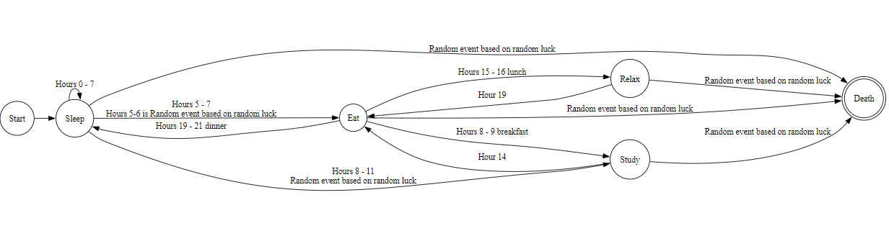

# Finite-State-Machine
Finite State Machine

States: start, sleep, eat, study, relax and death

Random events: dying in sleep, choking on food, brain aneurysm and reading Lovecraft. All random events based on random generated luck(for example: luck < 5, luck % 39 == 1).

Parameters: hunger, exhaustion and sanity. 

